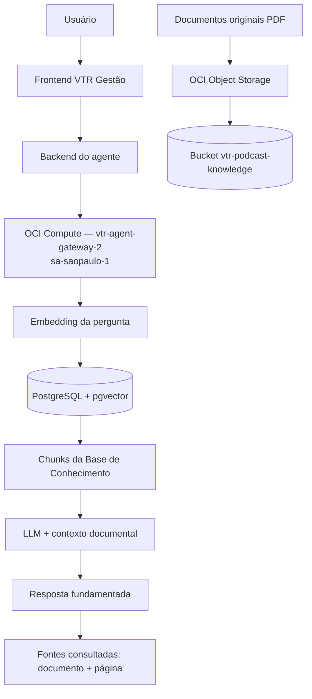
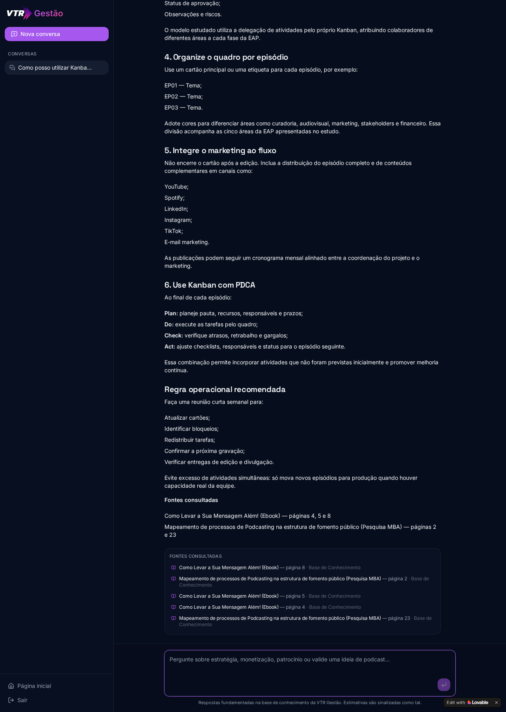
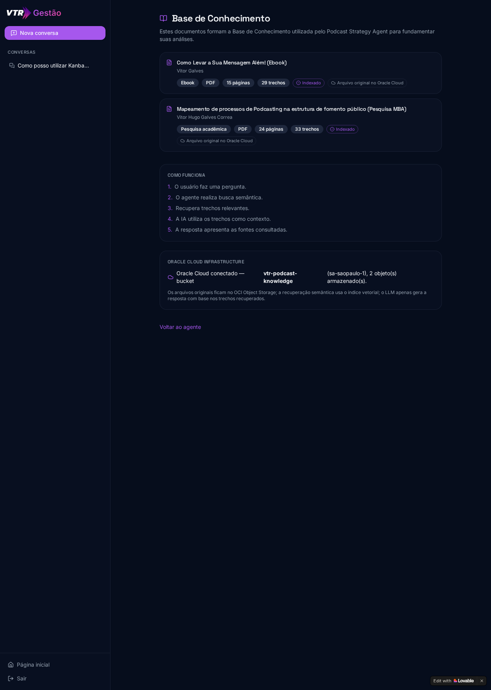
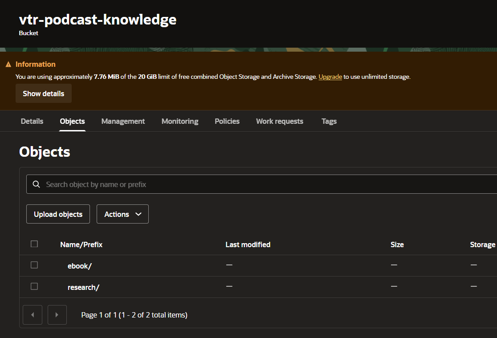
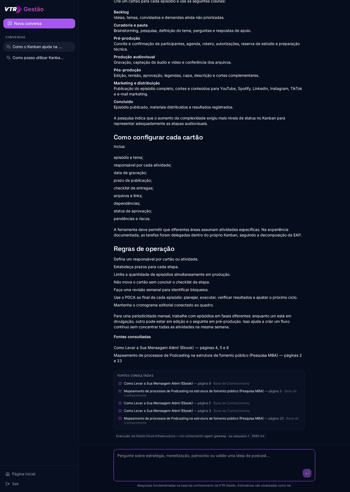

# VTR Gestão IA — Podcast Strategy Agent

> Agente de Inteligência Artificial com RAG para consulta estratégica de documentos sobre gestão e desenvolvimento de podcasts.

## Sobre o projeto

Projeto desenvolvido para o **Oracle ONE Challenge**. Ele adapta o desafio de "agente
corporativo baseado em documentos" para o contexto de **gestão estratégica de podcasts**.

O agente permite conversar com uma Base de Conhecimento documental e obter respostas
fundamentadas exclusivamente nas fontes disponíveis, sempre exibindo o documento e a
página consultados.

## Problema

Criadores e gestores de podcasts têm o conhecimento distribuído em pesquisas acadêmicas,
metodologias de gestão, editais de fomento e materiais próprios. Esse conteúdo é denso,
disperso e raramente consultado no momento da decisão.

O agente transforma esse conhecimento documental em uma interface conversacional.

## Solução

```
Usuário pergunta
   → a pergunta é transformada em embedding
   → busca vetorial recupera os trechos mais relevantes
   → os documentos fornecem o contexto
   → o LLM gera a resposta
   → as fontes utilizadas são apresentadas ao usuário
```

Regras aplicadas:

- **Memória ≠ Fonte**: o histórico da conversa serve apenas para continuidade; somente
  chunks recuperados dos documentos aparecem em "Fontes consultadas".
- Recuperação com top-k 8, máximo de 4 chunks por documento, limiar de similaridade e
  deduplicação antes do envio ao LLM.
- Perguntas sem sustentação documental **não recebem dados inventados**.

## Base de Conhecimento

| Documento | Tipo |
| --- | --- |
| Mapeamento de processos de Podcasting na estrutura de fomento público | Pesquisa MBA |
| Como Levar a Sua Mensagem Além! | Ebook |

Os arquivos originais estão armazenados no **Oracle Cloud Infrastructure Object Storage**.
O texto é extraído por página, dividido em chunks com metadados e indexado como embeddings
em PostgreSQL + pgvector.

## O que o agente consegue responder

- Planejamento de podcasts e podcast como projeto
- Metodologia híbrida de gestão
- EAP/WBS, Kanban, PDCA
- Pré-produção, produção e pós-produção
- Gestão de riscos, custos e recursos
- Stakeholders
- Planejamento de conteúdo e distribuição
- Fomento público, Sampa Cast, Amplifica Cine
- Organização e periodicidade de episódios

Fora desses limites, o agente informa explicitamente que não há sustentação documental
suficiente.

## Arquitetura

Fluxo real de uma pergunta:

```text
Usuário
   ↓
Frontend VTR Gestão
   ↓
Backend do agente
   ↓
OCI Compute Gateway  (Oracle Cloud — sa-saopaulo-1)
   ↓
RAG / pgvector
   ↓
Base de Conhecimento
   ↓
LLM
   ↓
Resposta fundamentada + fontes
```

Armazenamento dos documentos originais:

```text
Documentos originais
   ↓
OCI Object Storage
   ↓
bucket vtr-podcast-knowledge
```

> Transparência técnica: o **gateway de execução do agente** roda em **OCI Compute** e os
> **documentos originais** ficam em **OCI Object Storage**. A geração de embeddings, o banco
> PostgreSQL + pgvector e o LLM **não** rodam dentro da Oracle Cloud — eles são acionados a
> partir do gateway hospedado na OCI.




## Oracle Cloud Infrastructure — OCI

O projeto usa **dois serviços reais da Oracle Cloud**: Compute (execução) e Object
Storage (documentos originais).

### 1. OCI Compute — camada de execução do agente

- **Serviço:** OCI Compute (Always Free, `VM.Standard.E2.1.Micro`)
- **Instância:** `vtr-agent-gateway-2` — região `sa-saopaulo-1`
- **Função:** todas as recuperações de conhecimento do chat passam por este gateway
  hospedado na Oracle antes de chegar ao motor RAG.
- **Rede:** VCN dedicada, subnet pública, Internet Gateway e Security List restrita.
- **Segurança:** a chamada gateway → backend é autenticada por `AGENT_SHARED_SECRET`
  (header `x-agent-secret`); nenhuma credencial fica no frontend.
- **Resiliência:** se o gateway estiver indisponível, o núcleo faz fallback local —
  o produto nunca quebra.
- **Evidência no produto:** cada resposta exibe o selo
  *“Execução via Oracle Cloud Infrastructure — oci-compute/vtr-agent-gateway ·
  sa-saopaulo-1 · <latência> ms”*.

> Observação técnica: OCI Functions + API Gateway exigem o OCI Registry (OCIR), que
> retorna `FREE_TIER_NOT_SUPPORTED` nesta conta Always Free. A camada executável foi
> então hospedada em OCI Compute, mantendo o mesmo contrato HTTP.

### 2. OCI Object Storage — documentos originais

- **Bucket:** `vtr-podcast-knowledge`
- **Região:** `sa-saopaulo-1`
- **Objetos:**
  - `research/TCC_Versao_final_Vitor_Hugo_Galves_Correa.pdf`
  - `ebook/ebook_como_levar_a_sua_mensagem_alem_vitor_galves.pdf`

O sistema:

- autentica no OCI **server-side**;
- assina as requisições com **RSA-SHA256** (HTTP Signatures, padrão OCI);
- verifica a existência dos objetos no bucket antes de reportar status;
- mantém os documentos originais no Object Storage;
- **não expõe credenciais ao frontend** — a interface recebe apenas o estado da conexão
  e metadados públicos dos objetos.

A sincronização é **idempotente**: objetos já presentes não são reenviados.


## Tecnologias

- React + TypeScript
- TanStack Start (rotas e server functions)
- Tailwind CSS
- Lovable / Lovable Cloud
- PostgreSQL + pgvector
- Embeddings e LLM (arquitetura RAG)
- Oracle Cloud Infrastructure — Compute (execução do agente) e Object Storage

## Segurança

- Todos os secrets são **server-side**; nenhuma credencial chega ao cliente.
- `.env` não é versionado (`.gitignore`), assim como arquivos `.pem` e `.key`.
- A private key da OCI nunca é impressa em logs nem retornada por qualquer endpoint.
- As chamadas à OCI são autenticadas por assinatura RSA com fingerprint da API Key.
- Acesso à aplicação exige autenticação; dados por usuário são protegidos por RLS.
- Os documentos são consultados através da arquitetura RAG, com fontes rastreáveis.

## Como executar

```sh
git clone <url-do-repositorio>
cd <pasta-do-projeto>
npm install
cp .env.example .env   # preencha com seus próprios valores
npm run dev
```

Nenhuma credencial real é distribuída no repositório — use apenas placeholders do
`.env.example` e suas próprias chaves.

## Aplicação online

https://podcast-validator.lovable.app

## Evidências de execução

Todas as imagens abaixo são capturas reais do produto publicado e do Console da
Oracle Cloud Infrastructure. Os arquivos estão em `docs/evidencias/`.

### 01 — Agente funcionando em produção



### 02 — RAG respondendo com fontes


### 03 — Base de Conhecimento



### 04 — OCI Object Storage



Os documentos originais utilizados pela Base de Conhecimento estão armazenados no bucket
**`vtr-podcast-knowledge`** na **Oracle Cloud Infrastructure** (região `sa-saopaulo-1`),
organizados nos prefixos `ebook/` e `research/`. A captura acima é do Console OCI em
Object Storage → `vtr-podcast-knowledge` → aba **Objects**.

### 05 — Execução do agente via OCI Compute



## Requisitos do Challenge

| Requisito | Implementação | Status |
|---|---|---|
| Agente de IA conversacional | Podcast Strategy Agent | ✅ |
| Respostas fundamentadas em documentos | RAG + pgvector + citações | ✅ |
| Base de Conhecimento documental | Pesquisa MBA + Ebook | ✅ |
| Projeto disponível online | https://podcast-validator.lovable.app | ✅ |
| Uso de Oracle Cloud Infrastructure | Object Storage + OCI Compute | ✅ |
| Documentos armazenados na OCI | bucket `vtr-podcast-knowledge` | ✅ |
| Execução envolvendo OCI | OCI Compute Gateway | ✅ |
| Repositório público GitHub | https://github.com/vtrgalves/podcast-validator | ✅ |
| Evidências no README | `docs/evidencias` | ✅ |

